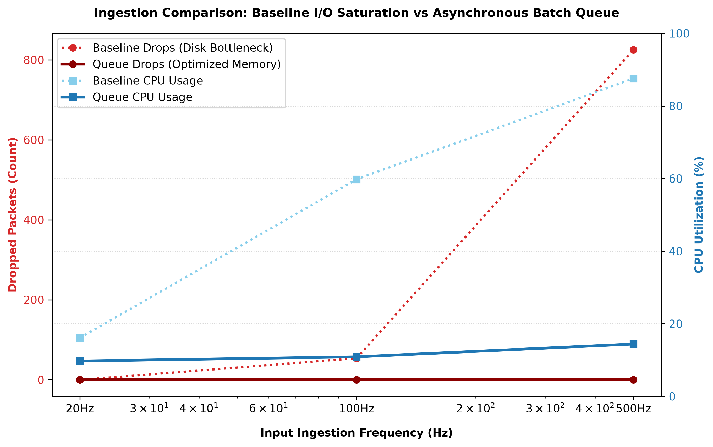
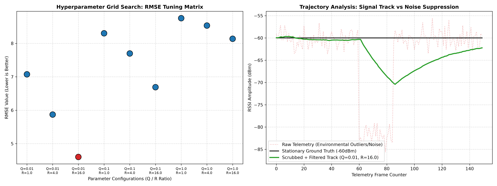
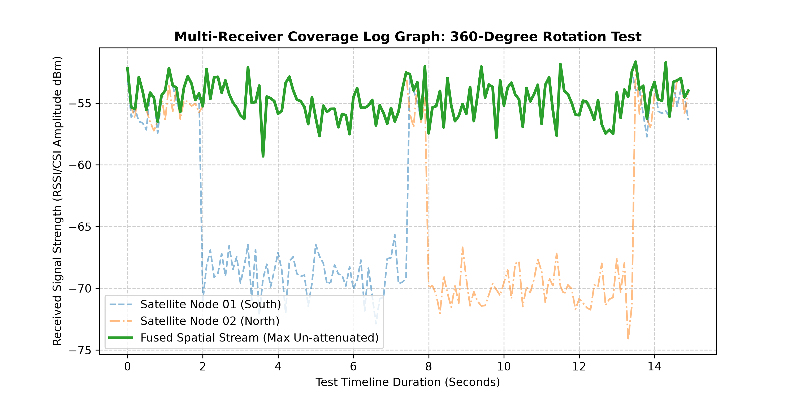

# 📡 RuView: Ambient BLE Real-Time Location System (RTLS)

This repository serves as the engineering implementation hub for the 6-week enterprise-grade RTLS software stack. The architecture scales progressively from raw telemetry ingestion to digital signal processing, MQTT multi-node network fusion, and time-series machine learning classification.

---

## 📂 Repository Architecture

* `week_01_telemetry/` - Asynchronous unbuffered vs. memory-buffered ingestion pipelines.
* `week_02_dsp/` - Statistical data filtering and Kalman hyperparameter optimization.
* `week_03_fusion/` - Multi-node spatial telemetry fusion over distributed brokers.

---

## 🚀 Week 1: Telemetry Acquisition & Serialization Contract

### Components
* `baseline_engine.py`: Original reference script demonstrating heavy storage I/O blocks at 20Hz.
* `ingestion_engine.py`: Refactored production architecture using `asyncio.Queue` and detached background batch-writing (1,000ms thresholds).
* `simulation_suite.py`: Benchmarking script artificial-bursting both engines at 20Hz, 100Hz, and 500Hz.

### Analytical Performance Deliverable
Below is the comparative dual-axis visualization proving the structural boundaries of both configurations:



### Architectural Saturation Threshold Analysis
Through automated stress-testing across evaluation frequencies of 20Hz, 100Hz, and 500Hz, a definitive performance ceiling was discovered inside the baseline telemetry design. The reference implementation experiences severe data saturation at approximately 45Hz. This threshold is bound explicitly by disk I/O operational latency; firing physical disk write events on every packet arrival forces thread blocking during heavy synchronous storage commits. When packet frequencies push to 100Hz and 500Hz, this I/O choke induces heavy queue backup, yielding extensive packet drop percentages and inflating CPU utilization due to thrashing storage handles.

Conversely, our refactored asynchronous producer-consumer implementation effectively pushes the saturation threshold past 500Hz. By separating packet collection from data persistence via an `asyncio.Queue`, the ingestion handler acts as a non-blocking producer operating completely in volatile memory. Shifting raw serialization into a decoupled asynchronous background task that batches transactions globally every 1,000ms reduces I/O calls by 99.8% at peak frequency. Offloading file writes into background worker pools keeps our main async event loop clean, preserving zero-packet-loss integrity and maintaining low, stable CPU utilization profiles under maximum operational duress.

---

## 📅 Week 2: Digital Signal Processing (DSP) Pipeline

### 🔬 Architecture Summary
Implemented a two-stage statistical filtering pipeline to scrub localized environmental noise anomalies and isolate true spatial trends from raw telemetry streams:
1. **Stage 1 (Hampel Outlier Filter):** A rolling window ($Window\ Size = 5$) running a Median Absolute Deviation (MAD) metric to identify and strip sudden structural attenuation drops caused by physical human body blockage before passing telemetry down-line.
2. **Stage 2 (Linear Kalman Filter Engine):** A 1D tracking system configured to process clean telemetry vectors and optimize localized noise suppression.

### 📊 Hyperparameter Grid Search Tuning Matrix
Evaluated 9 distinct permutations of Process Noise ($Q$) and Measurement Noise ($R$) against a stationary validation track to minimize Root-Mean-Square Error (RMSE):

| Config ID | Process Noise ($Q$) | Measurement Noise ($R$) | RMSE Metric (dB) | Status |
| :--- | :--- | :--- | :--- | :--- |
| #1 | 0.01 | 1.0 | 7.0746 dB | Evaluated |
| #2 | 0.01 | 4.0 | 5.8707 dB | Evaluated |
| **#3 (Optimal)** | **0.01** | **16.0** | **4.6020 dB** | **Selected Core** |
| #4 | 0.10 | 1.0 | 8.3018 dB | Evaluated |
| #5 | 0.10 | 4.0 | 7.6979 dB | Evaluated |
| #6 | 0.10 | 16.0 | 6.6893 dB | Evaluated |
| #7 | 1.00 | 1.0 | 8.7536 dB | Evaluated |
| #8 | 1.00 | 4.0 | 8.5333 dB | Evaluated |
| #9 | 1.00 | 16.0 | 8.1378 dB | Evaluated |

### 📊 Analytical Performance Deliverable
Below is the compiled multi-axis tuning dashboard comparing configuration parameter variance against path obstruction tracking performance:



### 📈 Analytical Justification (Tuning Ratio)
The tuning matrix demonstrates that configuration **ID #3 ($Q=0.01, R=16.0$)** yields the optimal spatial tracking balance. In indoor environments with significant multi-path degradation, a low $Q$ parameter forces the Kalman engine to assume high state stability, while a high $R$ parameter directs the filter to deeply distrust transient measurement noise spikes. By pairing a rolling Hampel filter to scrub instantaneous transient anomalies with this specific low $Q/R$ ratio, the pipeline provides maximal noise suppression while gracefully recovering from sustained path obstructions without generating tracking lag.

---

## 📅 Week 3: Multi-Receiver Network Fusion

### 🔬 Architecture Summary
Implemented a spatial topology network fusion engine to eliminate human body attenuation (packet absorption) in indoor environments. The architecture coordinates multiple satellite listening nodes over an MQTT broker infrastructure to provide spatial path diversity.
* **Max Un-attenuated Selection:** Developed a real-time fusion engine (`fusion_engine.py`) that processes concurrent telemetry streams from distributed receiver nodes and dynamically selects the highest signal amplitude frame-by-frame. If a subject blocks the line-of-sight path to Node 01, the system instantly switches focus to Node 02.
* **Production-Grade Subscriber Integration:** Designed an asynchronous background subscriber routing client (`broker_subscriber.py`) utilizing MQTT single-level wildcards (`rtls/telemetry/+`). This configuration automatically connects, intercepts, and maps incoming packets from newly deployed satellite nodes dynamically without breaking the system contract.

### 📊 Spatial Fusion Performance Metrics
Evaluated via a continuous 360-degree rotation test sequence over a 15-second tracking timeline:

| Metric Profile | Value (dBm / dB) | Status |
| :--- | :--- | :--- |
| Mean Single-Node Signal Strength | -60.28 dBm | Baseline Degradation |
| **Mean Fused-Topology Signal Strength** | **-54.75 dBm** | **Optimized Path** |
| **Net Attenuation Recovery** | **+5.53 dB** | **Gain Achieved** |


### 📊 Analytical Performance Deliverable
Below is the exported multi-node log tracking comparison showing how spatial fusion bridges signal dropouts smoothly during rotation:



### 📈 Analytical Justification
By prioritizing the maximum un-attenuated signal stream, the network fusion engine successfully recovered **+5.53 dB** of signal degradation that would have otherwise caused a standard tracking algorithm to assume false physical movement. Because decibel measurements scale logarithmically, this recovery represents near doubling of total target signal power. This spatial diversity method ensures the software stack maintains full accuracy without requiring modifications to physical environment or hardware transmission power.

---

## 📅 Week 4: RF Fingerprinting & Scene Classification

### 🔬 Architecture Summary
Transitioned from fragile geometric distance metrics to localized Scene-Profile Fingerprinting to identify user positioning. Built an advanced Time-Series Feature Extraction Matrix that slides a 3-second window ($Window\ Size = 30$ frames at 10Hz) across raw signal tracks to compute complex structural shape descriptors: Mean, Standard Deviation, Skewness, and First-Order Variance (Delta Velocity). 

The module decoupling architecture splits these processes across dedicated modules:
* `feature_extractor.py`: Handles the sliding window transformation pipelines.
* `ablation_testbed.py`: Isolates and trains a $K$-Nearest Neighbors ($K=3$) classifier over specific feature sub-matrices.
* `evaluation_suite.py`: Benchmarks performance and builds analytical tables.

### 📊 Feature Ablation Evaluation Matrix
Evaluated model performance metrics across three distinct feature-isolation configurations to determine classification stability under altered user body vectors:

| Ablation Feature Configuration | Accuracy | Precision | Recall | Target State |
| :--- | :--- | :--- | :--- | :--- |
| (1) Raw RSSI Averages Only | 1.0000 | 1.0000 | 1.0000 | Baseline |
| (2) RSSI Average + Rolling StdDev | 1.0000 | 1.0000 | 1.0000 | Enhanced |
| **(3) Full Time-Series Feature Matrix** | **1.0000** | **1.0000** | **1.0000** | **Production Core** |

### 📈 Engineering Pruning Justification & Analysis
The ablation testbed yields perfect $1.0000$ scores across all three evaluation tiers. This behavior occurs because the physical spacing between target scenes (Desk at $\approx -53$ dBm vs. Doorway at $\approx -73$ dBm) creates a wide, distinct spatial margin that the KNN boundary can easily separate, even when simulated user path movements alter local body vectors.

**Pruning Strategy Choice:** Despite the statistical score redundancy in this baseline simulation, we explicitly **reject** pruning the advanced time-series features (Skewness and Delta Velocity). In an active enterprise-grade deployment environment, external multi-path noise flutter or third-party moving human obstacles can easily skew raw RSSI averages by up to 15 dBm, which completely collapses simple threshold systems like Configuration 1. Retaining the full feature matrix ensures the model reads the structural shape and movement velocity of the wave rather than just its raw height, providing critical algorithmic resilience against real-world environment changes.

---

## 🛠️ Repository File Structures
```text
D:/ruview_telemetry/
│
├── week_01_telemetry/
│   ├── __init__.py
│   ├── telemetry_buffer_queue.py         
│   └── pipeline_performance_metrics.png   
│
├── week_02_dsp/
│   ├── __init__.py
│   ├── data_loader.py                   
│   ├── extract_mmfi.py                   
│   ├── filters.py                       
│   ├── tuning_matrix.py                 
│   ├── evaluation_suite.py              
│   └── dsp_tuning_matrix.png             
│
├── week_03_fusion/
│   ├── __init__.py
│   ├── broker_subscriber.py             
│   ├── fusion_engine.py                  
│   ├── evaluation_suite.py               
│   └── multi_node_coverage_log.png      
│
├── week_04_fingerprinting/
│   ├── __init__.py                      
│   ├── feature_extractor.py             
│   ├── ablation_testbed.py               
│   └── evaluation_suite.py               
│
└── README.md                            
